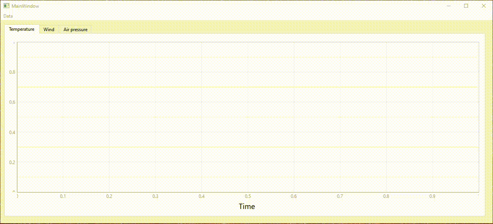

# WeatherStation GUI application
## Python GUI application that collects and displays enviroment data from the https://meteo.arso.gov.si/met/en/service2/ website.



This project is a simple approach of displaying enviroment data from the Slovenian environment agency. It displays temperature, wind speed and humidity data for 20 Slovenian cities listed on the agency website. The user can display all three data categories for one city at once.
### Installation
Create a virtual environment
```
mkdir weatherStation
cd weatherStation
python -m venv .
```
Install application from the TestPyPi server
```
pip install weatherStationApp
```
Or you can download the source code directly from the repository to your virtual environment
```
git clone https://github.com/RegularEverydayAverageGuy/WeatherStation
```
### Run
Run the application
```
weatherStation
```
You can also run it with the **-u** flag which updates the enviroment data
```
weatherStation -u
```
Or if you download the source code
```
python weatherStation.py -u
```
### Tests
The test are stored in the **WeatherStation/App/Test** subdirectory and can be run with the source code
```
coverage run -m unittest discover Tests
```
if you are located in the parent directory of Tests where the test results are also stored in the *htmlcov** subdirectory.
